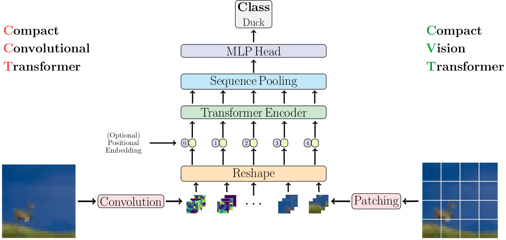
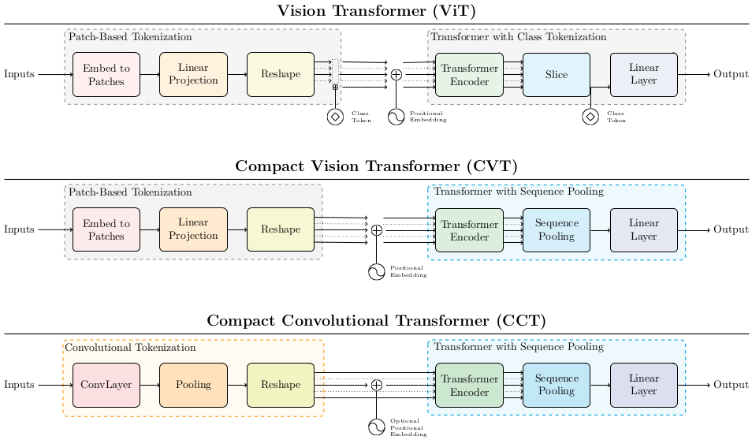

# Compact Transformers

	
[](https://paperswithcode.com/sota/image-classification-on-flowers-102?p=escaping-the-big-data-paradigm-with-compact)

Preprint Link: [Escaping the Big Data Paradigm with Compact Transformers
](https://arxiv.org/abs/2104.05704)

By [Ali Hassani<sup>[1]</sup><span>&#42;</span>](https://alihassanijr.com/),
[Steven Walton<sup>[1]</sup><span>&#42;</span>](https://stevenwalton.github.io/),
[Nikhil Shah<sup>[1]</sup>](https://itsshnik.github.io/),
[Abulikemu Abuduweili<sup>[1]</sup>](https://github.com/Walleclipse),
[Jiachen Li<sup>[1,2]</sup>](https://chrisjuniorli.github.io/), 
and
[Humphrey Shi<sup>[1,2,3]</sup>](https://www.humphreyshi.com/)


<small><span>&#42;</span>Ali Hassani and Steven Walton contributed equal work</small>

In association with SHI Lab @ University of Oregon<sup>[1]</sup> and
UIUC<sup>[2]</sup>, and Picsart AI Research (PAIR)<sup>[3]</sup>




## Other implementations & resources
**[PyTorch blog]**: check out our [official blog post with PyTorch](https://medium.com/pytorch/training-compact-transformers-from-scratch-in-30-minutes-with-pytorch-ff5c21668ed5) to learn more about our work and vision transformers in general.

**[Keras]**: check out [Compact Convolutional Transformers on keras.io](https://keras.io/examples/vision/cct/) by [Sayak Paul](https://github.com/sayakpaul).

**[vit-pytorch]**: CCT is also available through [Phil Wang](https://github.com/lucidrains)'s [vit-pytorch](https://github.com/lucidrains/vit-pytorch), simply use ```pip install vit-pytorch```


# Abstract
With the rise of Transformers as the standard for language processing, 
and their advancements in computer vision, along with their unprecedented size 
and amounts of training data, many have come to believe that they are not suitable 
for small sets of data. This trend leads to great concerns, including but 
not limited to: limited availability of data in certain scientific domains and the 
exclusion of those with limited resource from research in the field. In this paper, 
we dispel the myth that transformers are “data hungry” and therefore can only be 
applied to large sets of data. We show for the first time that with the right size and 
tokenization, transformers can perform head-to-head with state-of-the-art CNNs on 
small datasets, often with bet-ter accuracy and fewer parameters. Our model eliminates 
the requirement for class token and positional embeddings through a novel sequence 
pooling strategy and the use of convolution/s. It is flexible in terms of model size, 
and can have as little as 0.28M parameters while achieving good results. Our model can 
reach 98.00% accuracy when training from scratch on CIFAR-10, which is a significant 
improvement over previous Transformer based models. It also outperforms many modern CNN 
based approaches, such as ResNet, and even some recent NAS-based approaches,such as 
Proxyless-NAS. Our simple and compact design democratizes transformers by making them 
accessible to those with limited computing resources and/or dealing with small datasets. 
Our method also works on larger datasets, such as ImageNet (82.71% accuracy with 29% parameters 
of ViT),and NLP tasks as well.
 
#### ViT-Lite: Lightweight ViT 
Different from [ViT](https://arxiv.org/abs/2010.11929) we show that <i>an image 
is <b>not always</b> worth 16x16 words</i> and the image patch size matters.
Transformers are not in fact ''data-hungry,'' as the authors proposed, and
smaller patching can be used to train efficiently on smaller datasets.

#### CVT: Compact Vision Transformers
Compact Vision Transformers better utilize information with Sequence Pooling post 
encoder, eliminating the need for the class token while achieving better
accuracy.

#### CCT: Compact Convolutional Transformers
Compact Convolutional Transformers not only use the sequence pooling but also
replace the patch embedding with a convolutional embedding, allowing for better
inductive bias and making positional embeddings optional. CCT achieves better
accuracy than ViT-Lite and CVT and increases the flexibility of the input
parameters.



# How to run

## Install locally

Our base model is in pure PyTorch and Torchvision. No extra packages are required.
Please refer to [PyTorch's Getting Started](https://pytorch.org/get-started/locally/) page for detailed instructions.

Here are some of the models that can be imported from `src` (full list available in [Variants.md](Variants.md)):

<table style="width:100%">
    <thead>
        <tr>
            <td><b>Model</b></td>
            <td><b>Resolution</b></td>
            <td><b>PE</b></td>
            <td><b>Name</b></td>
            <td><b>Pretrained Weights</b></td>
            <td><b>Config</b></td>
        </tr>
    </thead>
    <tbody>
        <tr>
            <td rowspan=4>CCT-7/3x1</td>
            <td rowspan=4>32x32</td>
            <td>Learnable</td>
            <td><code>cct_7_3x1_32</code></td>
            <td>CIFAR-10/300 Epochs</td>
            <td><code>pretrained/cct_7-3x1_cifar10_300epochs.yml</code></td>
        </tr>
        <tr>
            <td>Sinusoidal</td>
            <td><code>cct_7_3x1_32_sine</code></td>
            <td>CIFAR-10/5000 Epochs</td>
            <td><code>pretrained/cct_7-3x1_cifar10_5000epochs.yml</code></td>
        </tr>
        <tr>
            <td>Learnable</td>
            <td><code>cct_7_3x1_32_c100</code></td>
            <td>CIFAR-100/300 Epochs</td>
            <td><code>pretrained/cct_7-3x1_cifar100_300epochs.yml</code></td>
        </tr>
        <tr>
            <td>Sinusoidal</td>
            <td><code>cct_7_3x1_32_sine_c100</code></td>
            <td>CIFAR-100/5000 Epochs</td>
            <td><code>pretrained/cct_7-3x1_cifar100_5000epochs.yml</code></td>
        </tr>
        <tr>
            <td>CCT-7/7x2</td>
            <td>224x224</td>
            <td>Sinusoidal</td>
            <td><code>cct_7_7x2_224_sine</code></td>
            <td>Flowers-102/300 Epochs</td>
            <td><code>pretrained/cct_7-7x2_flowers102.yml</code></td>
        </tr>
        <tr>
            <td rowspan=3>CCT-14/7x2</td>
            <td>224x224</td>
            <td rowspan=3>Learnable</td>
            <td><code>cct_14_7x2_224</code></td>
            <td>ImageNet-1k/300 Epochs</td>
            <td><code>pretrained/cct_14-7x2_imagenet.yml</code></td>
        </tr>
        <tr>
            <td>384x384</td>
            <td><code>cct_14_7x2_384</code></td>
            <td>ImageNet-1k/Finetuned/30 Epochs</td>
            <td><code>finetuned/cct_14-7x2_imagenet384.yml</code></td>
        </tr>
        <tr>
            <td>384x384</td>
            <td><code>cct_14_7x2_384_fl</code></td>
            <td>Flowers102/Finetuned/300 Epochs</td>
            <td><code>finetuned/cct_14-7x2_flowers102.yml</code></td>
        </tr>
    </tbody>
</table>

You can simply import the names provided in the **Name** column:
```python3
from src import cct_14_7x2_384
model = cct_14_7x2_384(pretrained=True, progress=True)
```
The config files are provided both to specify the training settings and hyperparameters, 
and allow easier reproduction.

Please note that the models missing pretrained weights will be updated soon. They were previously 
trained using our old training script, and we're working on training them again with the new script 
for consistency.

You could even create your own models with different image resolutions, positional embeddings, and number of classes:
```python3
from src import cct_14_7x2_384, cct_7_7x2_224_sine
model = cct_14_7x2_384(img_size=256)
model = cct_7_7x2_224_sine(img_size=256, positional_embedding='sine')
```
Changing resolution and setting `pretrained=True` will interpolate the PE vector to support the new size, 
just like ViT.

These models are also based on experiments in the paper. You can create your own versions:
```python3
from src import cct_14
model = cct_14(arch='custom', pretrained=False, progress=False, kernel_size=5, n_conv_layers=3)
```

You can even go further and create your own custom variant by importing the class CCT.

All of these apply to CVT and ViT as well.


## Training

[timm](https://github.com/rwightman/pytorch-image-models) is recommended for image classification training 
and required for the training script provided in this repository:
### Distributed training
```shell
./dist_classification.sh $NUM_GPUS -c $CONFIG_FILE /path/to/dataset
```

You can use our training configurations provided in `configs/`:
```shell
./dist_classification.sh 8 -c configs/imagenet.yml --model cct_14_7x2_224 /path/to/ImageNet
```

### Non-distributed training
```shell
python train.py -c configs/datasets/cifar10.yml --model cct_7_3x1_32 /path/to/cifar10
```

### Models and config files
We've updated this repository and moved the previous training script and the checkpoints associated 
with it to `examples/`. The new training script here is just the `timm` training script. We've provided
the checkpoints associated with it in the next section, and the hyperparameters are all provided in
`configs/pretrained` for models trained from scratch, and `configs/finetuned` for fine-tuned models.

# Results
Type can be read in the format `L/PxC` where `L` is the number of transformer
layers, `P` is the patch/convolution size, and `C` (CCT only) is the number of
convolutional layers.

## CIFAR-10 and CIFAR-100

<table style="width:100%">
    <thead>
        <tr>
            <td><b>Model</b></td>
            <td><b>Pretraining</b></td> 
            <td><b>Epochs</b></td> 
            <td><b>PE</b></td>
            <td><b>CIFAR-10</b></td> 
            <td><b>CIFAR-100</b></td> 
        </tr>
    </thead>
    <tbody>
        <tr>
            <td rowspan=3>CCT-7/3x1</td>
            <td rowspan=3>None</td>
            <td>300</td>
            <td>Learnable</td>
            <td><a href="https://shi-labs.com/projects/cct/checkpoints/pretrained/cct_7_3x1_32_cifar10_300epochs.pth">96.53%</a></td>
            <td><a href="https://shi-labs.com/projects/cct/checkpoints/pretrained/cct_7_3x1_32_cifar100_300epochs.pth">80.92%</a></td>
        </tr>
        <tr>
            <td>1500</td>
            <td>Sinusoidal</td>
            <td><a href="https://shi-labs.com/projects/cct/checkpoints/pretrained/cct_7_3x1_32_sine_cifar10_1500epochs.pth">97.48%</a></td>
            <td><a href="https://shi-labs.com/projects/cct/checkpoints/pretrained/cct_7_3x1_32_sine_cifar100_1500epochs.pth">82.72%</a></td>
        </tr>
        <tr>
            <td>5000</td>
            <td>Sinusoidal</td>
            <td><a href="https://shi-labs.com/projects/cct/checkpoints/pretrained/cct_7_3x1_32_sine_cifar10_5000epochs.pth">98.00%</a></td>
            <td><a href="https://shi-labs.com/projects/cct/checkpoints/pretrained/cct_7_3x1_32_sine_cifar100_5000epochs.pth">82.87%</a></td>
        </tr>
    </tbody>
</table>

## Flowers-102

<table style="width:100%">
    <thead>
        <tr>
            <td><b>Model</b></td>
            <td><b>Pre-training</b></td>
            <td><b>PE</b></td>
            <td><b>Image Size</b></td>
            <td><b>Accuracy</b></td>
        </tr>
    </thead>
    <tbody>
        <tr>
            <td>CCT-7/7x2</td>
            <td>None</td>
            <td>Sinusoidal</td>
            <td>224x224</td>
            <td><a href="https://shi-labs.com/projects/cct/checkpoints/pretrained/cct_7_7x2_224_flowers102.pth">97.19%</a></td>
        </tr>
        <tr>
            <td>CCT-14/7x2</td>
            <td>ImageNet-1k</td>
            <td>Learnable</td>
            <td>384x384</td>
            <td><a href="https://shi-labs.com/projects/cct/checkpoints/finetuned/cct_14_7x2_384_flowers102.pth">99.76%</a></td>
        </tr>
    </tbody>
</table>

## ImageNet

<table style="width:100%">
    <thead>
        <tr>
            <td><b>Model</b></td> 
            <td><b>Type</b></td> 
            <td><b>Resolution</b></td> 
            <td><b>Epochs</b></td> 
            <td><b>Top-1 Accuracy</b></td>
            <td><b># Params</b></td> 
            <td><b>MACs</b></td>
        </tr>
    </thead>
    <tbody>
        <tr>
            <td rowspan=1><a href="https://github.com/google-research/vision_transformer/">ViT</a></td>
            <td>12/16</td>
	        <td>384</td>
	        <td>300</td>
            <td>77.91%</td>
            <td>86.8M</td>
            <td>17.6G</td>
        </tr>
        <tr>
            <td rowspan=2>CCT</td>
            <td>14/7x2</td>
	        <td>224</td>
            <td>310</td>
            <td><a href="https://shi-labs.com/projects/cct/checkpoints/pretrained/cct_14_7x2_224_imagenet.pth">80.67%</a></td>
            <td>22.36M</td>
            <td>5.11G</td>
        </tr>
        <tr>
            <td>14/7x2</td>
	        <td>384</td>
            <td>310 + 30</td>
            <td><a href="https://shi-labs.com/projects/cct/checkpoints/finetuned/cct_14_7x2_384_imagenet.pth">82.71%</a></td>
            <td>22.51M</td>
            <td>15.02G</td>
        </tr>
    </tbody>
</table>

# NLP
NLP results and instructions have been moved to [nlp/](nlp/README.md).

# Citation
```bibtex
@article{hassani2021escaping,
	title        = {Escaping the Big Data Paradigm with Compact Transformers},
	author       = {Ali Hassani and Steven Walton and Nikhil Shah and Abulikemu Abuduweili and Jiachen Li and Humphrey Shi},
	year         = 2021,
	url          = {https://arxiv.org/abs/2104.05704},
	eprint       = {2104.05704},
	archiveprefix = {arXiv},
	primaryclass = {cs.CV}
}
```
